# SignBridge

Real-time two-way sign language and speech communication through orchestrated pre-trained AI models
(University of London CM3070, Project Idea 4.1: *Orchestrating AI models to achieve a goal*).

A browser-based video call in which a Deaf signer and a hearing speaker understand each other. The app opens on a
**feature-selection landing screen**: a caller picks "I sign" or "I speak" before anything else is shown, and that
choice locks the call screen that follows to one pipeline's tools — a presentation lock only, not a network one, so
either side still receives and reacts to whatever the other side sends:

* **Pipeline A, sign → speech** (the "I sign" screen). Webcam → MediaPipe Hands (21 landmarks, in the browser) → my
  landmark classifier (ONNX, in the browser) → letters, built-in signs and phrases → sentence smoother (sign grammar →
  dictionary → local LLM with a faithfulness guard) → speech. The signer profile, letter/phrase library and
  calibration tools live in a collapsible drawer on this screen, and the avatar showing the partner's speech signed
  back has its own dedicated panel next to the video, not an overlay.
* **Pipeline B, speech → sign** (the "I speak" screen). Microphone → Whisper (local backend) → captions + tone tag →
  ASL sign plan → animated signing avatar (rendered on the partner's, signing, screen).
* **Call layer.** Two people join a room; video/audio go peer to peer over WebRTC and the recognised sentences and
  captions travel on a WebRTC data channel. The backend only relays connection set-up.

Everything runs on the user's own machine; no raw audio or video is sent to a third party.

## Walkthrough

A static walkthrough of one full conversation between a signer and a speaker, captured from the running app
(webcam feeds are shown as placeholders).

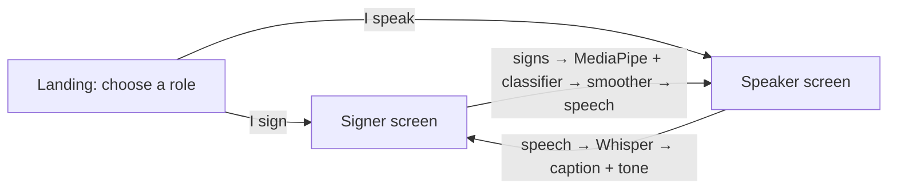

**1. Choose a role.** The landing screen asks whether you will sign or speak; the call screen that follows shows only
that side's tools.

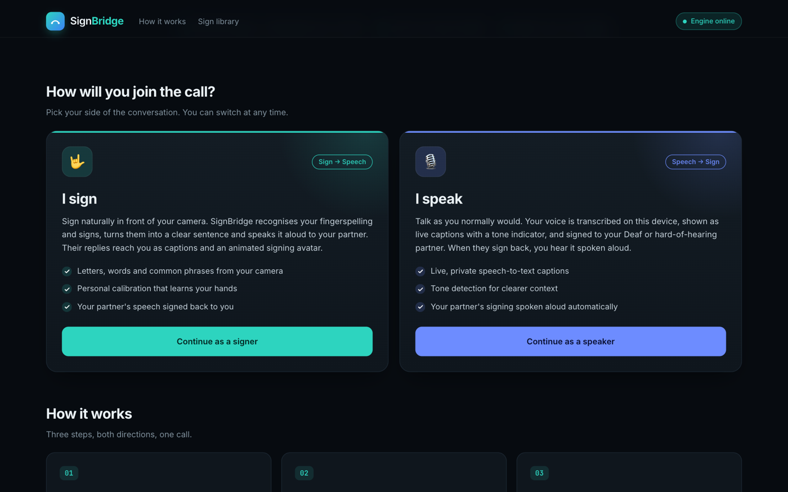

**2. Join a room.** The signer's screen before the call: partner video, your own camera, the sign composer, and the
avatar panel that will sign the partner's speech back. Both callers enter the same room name and press *Join call*.

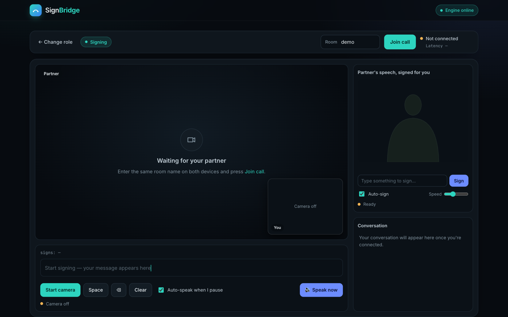

**3. The speaker talks.** Their speech is transcribed locally by Whisper and shown with a tone tag
("Hi, how are you today?" · Neutral).

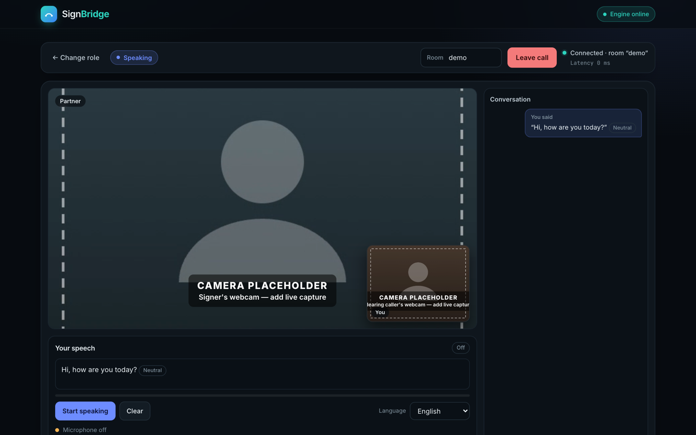

**4. The signer sees it signed.** The caption arrives over the data channel, and the avatar signs it as an ASL gloss
plan (HELLO → HOW → YOU → #TODAY).

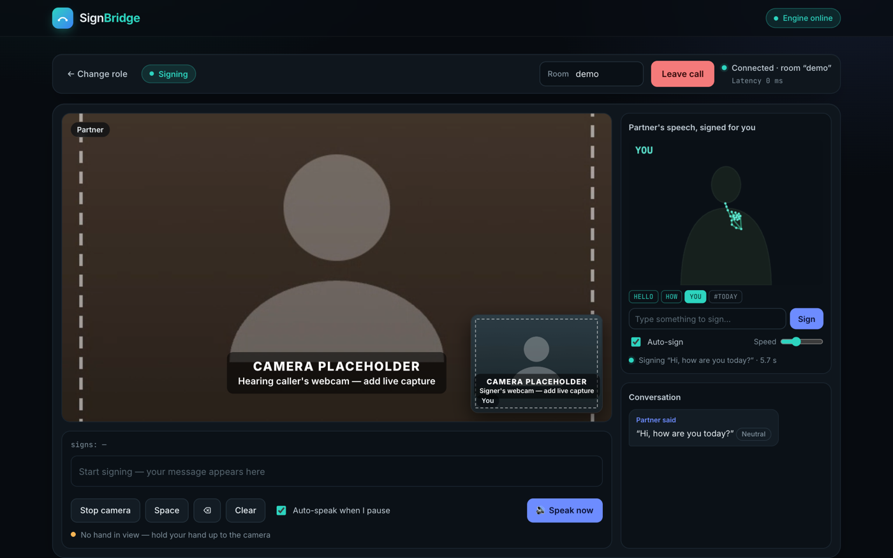

**5. The signer replies.** Recognised letters and phrases build up in the composer; with *Auto-speak when I pause*
on, a two-second pause sends it automatically (or press *Speak now*).

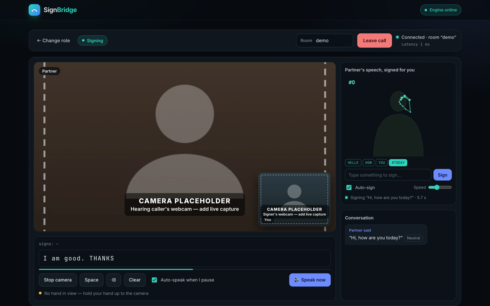

**6. Sent.** The smoother turns the signed input into a clean sentence ("I am good thanks.") and sends it.

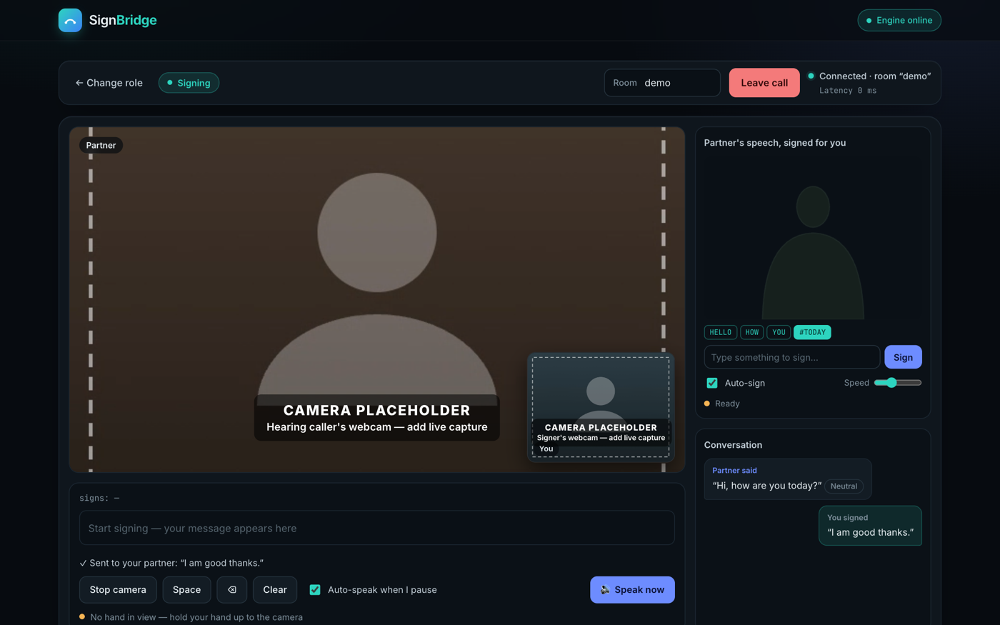

**7. The speaker hears it.** The sentence appears in the speaker's conversation and is spoken aloud.

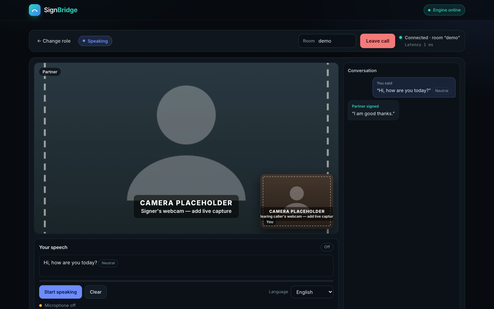

**8. Practice mode.** Pick a letter, watch the avatar demonstrate it, and sign it yourself; SignBridge marks it
*Matched* only once it really recognises it.

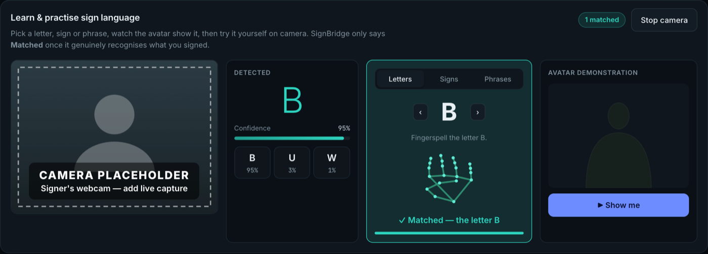

Phrases are practised the same way, one sign after another.

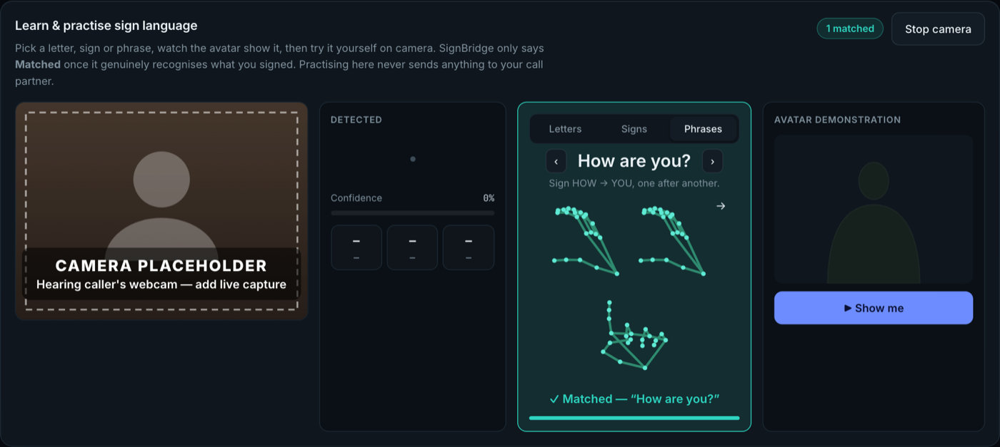

**9. Sign library.** Every letter and built-in phrase the app recognises out of the box.

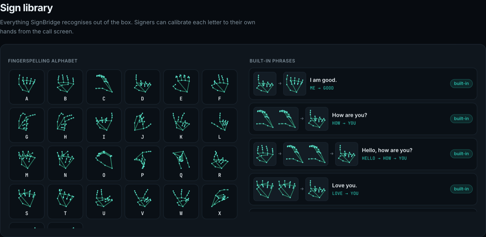

## Run it

```bash
bash run.sh                 # creates .venv, installs the backend, serves http://localhost:8000
```

Optional local LLM for the sentence smoother (otherwise the rule-based path is used):

```bash
brew install ollama && ollama serve &      # or install from ollama.com
ollama pull llama3.2:3b                    # override with SIGNBRIDGE_LLM_MODEL=llama3:8b
```

**Ollama is entirely optional — the app runs without it.** `run.sh` only checks whether Ollama is reachable and
prints a note either way; it never installs or requires it. If Ollama isn't running, `/api/health` reports
`llm_available: false` and the sentence smoother automatically takes its rule-based/dictionary path instead of the
LLM path (see `backend/smoother.py`, route `rules_llm_unavailable`) — every other feature (sign recognition, speech
transcription, tone tagging, the call layer) is unaffected. The only difference is that the small subset of
sentences that need LLM-based repair get the plain rule-based sentence instead of the LLM-polished one. So cloning
this repo and running `bash run.sh` with no Ollama installed is a fully supported, non-crashing way to try the
project.

Open **http://localhost:8000** in Chrome and allow camera + microphone. Choose "I sign" or "I speak" on the landing
screen. To try the call, open the page in two windows (or two computers on the same network), choose a role in each
— "I sign" in one, "I speak" in the other, to see both pipelines — and press *Join call* with the same room name in
both. "← change role" on the call screen leaves the call and returns to the landing screen.

The page also works with only `python3 -m http.server` (no backend): sign recognition still works, speech falls back to
the browser's Web Speech API (which uses a cloud service in Chrome and is labelled as not private), and there is no
smoothing, tone or call.

## Layout

```
frontend/   index.html, css/, js/   browser app: a landing (role-selection) screen + a call screen, built from 19 classic
                                     scripts in dependency order; js/16-roles.js = role selection & screen routing,
                                     js/call.js = WebRTC, js/api.js = backend client
backend/    app.py                  FastAPI: /api/transcribe (Whisper), /api/tone, /api/decode (dictionary decoder), /api/smooth, /ws/{room} signalling
            engines.py smoother.py  model wrappers; smoother = evaluated orchestration (v3) + Ollama client
artifacts/  *.onnx, eval/           trained classifiers (browser), figures, all evaluation results
evaluation/ *.py                    every evaluation experiment; `bash evaluation/run_all.sh` reproduces artifacts/eval/
tests/      test_signbridge.py      unit tests (preprocessing, grammar, decoder, personalisation, models, JS/Python parity)
            test_backend.py         API, smoother routing and signalling tests (models stubbed)
            e2e/e2e_call.mjs        full end-to-end integration test: two real browsers, the real backend, a live call (see below)
run_experiment.py                   trains the letter classifier and produces the single-signer results and ONNX exports
docs/flow/                          screenshots used in the walkthrough above
live_demo.html                      the earlier single-file demo (kept for reference; superseded by frontend/)
```

## Models orchestrated

| Modality | Model | Where it runs | Role |
|---|---|---|---|
| Image | MediaPipe Hands | browser (WebAssembly) | 21 hand landmarks per frame |
| Image (landmarks) | MLP classifier trained for this project, ONNX | browser | letters A–Z |
| Audio | OpenAI Whisper (`base` by default) | backend | speech → text |
| Text | `tabularisai/multilingual-sentiment-analysis` | backend | tone of the transcript |
| Text | Llama 3.2 3B via Ollama (optional) | local | repair fingerspelling errors into a sentence |

## Tests and evaluation

```bash
.venv/bin/python -m pytest tests -q        # 51 tests, no model downloads needed
bash evaluation/run_all.sh                 # full evaluation (downloads datasets and models; hours on a laptop)
```

`tests/e2e/e2e_call.mjs` is a separate, full end-to-end integration test: it opens two real Chromium browsers
(via Playwright) against the real, running backend, has each one pick a role on the landing screen (and asserts
that the role lock actually hides the other pipeline's tools and shows the avatar panel only to the signer),
joins them to the same call, and drives both directions of the app (typing, the decoder, the smoother, the call
layer, and the browser's own VAD and WAV encoder) through the same functions the interface itself calls. It
needs a browser and is not part of `pytest tests`.

```bash
npm i -D playwright-core                                          # once
.venv/bin/python -m uvicorn backend.app:app --port 8130 &          # SIGNBRIDGE_FAKE_MODELS=1 if you don't want real Whisper
node tests/e2e/e2e_call.mjs http://localhost:8130 screenshots/     # screenshots/ is optional
```

Results are summarised in `artifacts/eval/EVALUATION_SUMMARY.md`. The scripts in `evaluation/` evaluate Whisper `base`,
the tone model, and a small stand-in LLM (Qwen2.5-0.5B-Instruct) for the smoother; see the report for the differences from
the deployed configuration.
